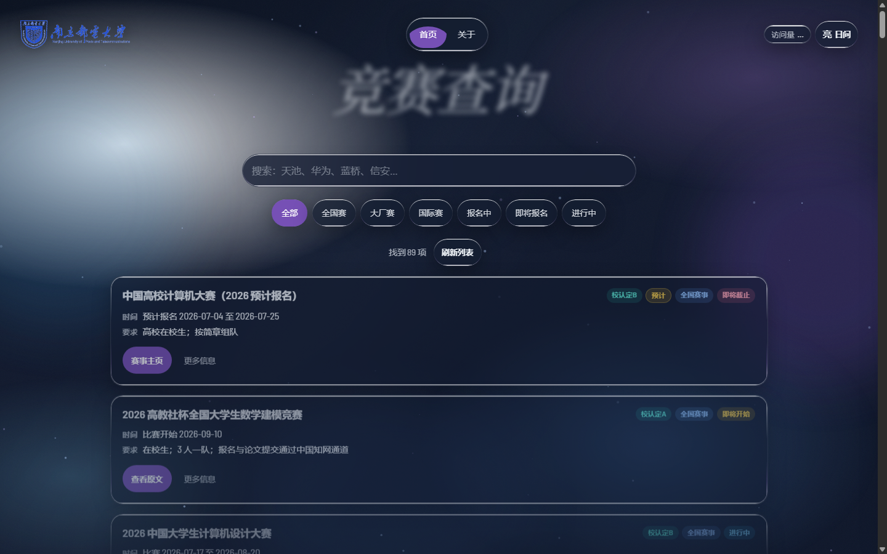

# 竞赛查询（南邮 · 计算机相关）

<p align="center">
  
</p>

<p align="center">
  <a href="https://njupt.cs-contest.cn"></a>
  &nbsp;
  <a href="https://njupt.cs-contest.cn"></a>
  &nbsp;
  
</p>

<p align="center">
  <a href="https://github.com/DoTrungHuy/competition-search/actions/workflows/ci.yml"></a>
  <a href="https://github.com/DoTrungHuy/competition-search/actions/workflows/weekly-sync.yml"></a>
  
  
</p>

面向 **南京邮电大学学生** 的竞赛信息查询站：快速查找还能报名、即将开报、正在进行或即将开赛的比赛，并跳到官网或品牌入口核对原文。

**线上地址：<https://njupt.cs-contest.cn>**

### 首页预览

<p align="center">
  
</p>

<p align="center"><sub>本地验收截图（暗色主题）；线上见 <a href="https://njupt.cs-contest.cn">njupt.cs-contest.cn</a></sub></p>

---

## 面向对象

| 对象 | 能帮什么 |
|------|----------|
| 南邮在校生（尤其计软网安等） | 按关键词/类型筛竞赛，看时间与参赛要求摘要 |
| 想冲校认定目录的同学 | 标有「校认定 A/B/C/C2」的条目来自学校创新创业竞赛认定目录中的计算机相关固定清单 |
| 辅导员/实验室同学 | 分享同一入口，减少到处翻通知 |

**不是**学校官方报名系统，也**不能**代替赛事官网与校内正式通知。

---

## 能做什么

- **搜索**：名称、品牌、标签等
- **筛选**：全部 / 全国赛 / 大厂赛 / 国际赛；以及 **报名中**、**即将开始报名**、**进行中** 等状态
- **卡片信息**：时间线、简要要求、状态角标；校认定档位；「预计」标记
- **外链**：有已核验原文 →「查看原文」；预计或仅品牌入口 →「赛事主页」
- **关于页**：状态与数据边界说明（`about.html`）

### 状态怎么理解（产品规则）

| 状态 | 含义 |
|------|------|
| **报名中** | 报名窗口开着（已核验官方日期，或固定清单上标了「预计」的推算窗口） |
| **即将开始报名** | 开报日在未来 **1～30 天**内（不含开报当天）；**国际赛不进**此筛选 |
| **即将开始** | 比赛尚未开始（常有比赛日、报名可能已结束或未录入） |
| **进行中** | 比赛日已到且未结束 |
| **预计** | 报名日据往年已核验窗口推算，**不是**官网通知；按钮只给品牌官网，不给假报名深链 |

其它约定：

- **「全部」主栏**默认是国内相关赛事；**国际赛**单独成类（黑客松等在报时，请点「国际赛」或搜索）。
- 「学校网站有相关通知」只说明校内发过通知，**不等于**学校主办。
- 待人工复核、无可靠赛程的条目不显示精确公开状态，多为「见官网详情」。
- 页面上的「刷新列表」只重新加载本站已保存的数据，**不会**当场去外网抓取。

---

## 在线使用

打开 **[https://njupt.cs-contest.cn](https://njupt.cs-contest.cn)** 即可，无需安装。

| | |
|:--|:--|
| 官网 | https://njupt.cs-contest.cn |
| 关于 | https://njupt.cs-contest.cn/about.html |

建议用手机或电脑现代浏览器；若刚更新后内容异常，可强制刷新（Ctrl+F5 / 清缓存）。

---

## 本地预览（开发/验收）

```bash
npm run serve
```

浏览器打开 <http://localhost:4173>。  
页面需要通过 HTTP 加载 JSON。

```bash
npm test                          # JS 语法 + 单元测试 + 生产数据校验
npm run test:e2e                  # 浏览器冒烟测试（需 playwright + chromium）
python scripts/validate_data.py   # 仅数据校验
python scripts/check_links.py     # 外链巡检（生成 reports/，不入库）
```

`test:e2e` 刻意不并入 `npm test`：它需要额外装 chromium 且要起浏览器，
日常跑 `npm test` 不该被拖慢。CI 里作为独立 job 并行执行。

```bash
python -m pip install -r requirements-playwright.txt
python -m playwright install chromium
```

脚本依赖：

```bash
python -m pip install -r requirements-scripts.txt
```

---

## 项目如何实现（维护者）

技术形态：**纯静态站**（HTML / CSS / JS + `data/*.json`），无前端构建。  
线上通过 **Cloudflare Workers 静态资源** 发布根目录（见 `wrangler.toml`）；域名 **cs-contest.cn**（**njupt.cs-contest.cn** 同样可用）。

### 目录要点

| 路径 | 作用 |
|------|------|
| `index.html` / `about.html` | 查询页 / 关于 |
| `js/status.js` | 报名/比赛状态、芯片契约、外链诚信解析 |
| `js/app.js` | 列表、筛选、抽屉 |
| `data/competitions.json` / `brands.json` / `portals.json` | 生产数据（schema v3） |
| `scripts/validate_data.py` | 数据闸门（含链接诚信） |
| `scripts/link_integrity.py` | 禁止预计假深链、`?estimate=` 等 |
| `scripts/apply_registration_estimates.py` | 固定清单「预计报名」维护 |
| `assets/images/readme/home.png` | README 首页预览图 |
| `404.html` / `assets/favicon.svg` | 404 页（`wrangler.toml` 的 `not_found_handling`）/ 站点图标 |
| `tests/e2e/test_smoke.py` | 浏览器冒烟测试（Playwright，覆盖无法单测的 `app.js`） |
| `.github/workflows/ci.yml` | push/PR：`npm test` + 独立的 E2E job |
| `.github/workflows/weekly-sync.yml` | 周更：采集 → **健康汇总** → 审核 → 合并 → **刷新预计** → 校验 → 通过才提交 |

### 数据原则

1. **已核验**记录：需要 `last_checked`、可用赛程或官方状态；赛事深链不得与品牌首页简单重复，也不得带伪参数。  
2. **待复核**（`needs_review`）：不写公开精确报名/比赛日进状态计算。  
3. **预计报名**：仅 `njupt_fixed` 且存在往年已核验 `registration_*` 时生成；**不写** `link`（`link_kind: brand_home`）；前端只打开品牌 `official_home`。  
4. 官方 `registration_*` **优先于**预计字段。  
5. **人工状态覆盖有有效期**：`已结束 / 已停办 / 报名结束` 是稳定终态，长期有效；`报名中 / 即将开始报名 / 即将开始 / 进行中` 属动态状态，自 `last_checked` 起 90 天有效，可用 `status_override_until` 显式指定。过期后前端回落到日期推导，无日期则显示「待复核」——宁可承认不知道，也不长期谎报「现在能报名」。校验器对过期只告警不报错，避免一条陈旧数据中断无人值守的周更。

手动刷新预计（一般不必，周更会跑）：

```bash
python scripts/apply_registration_estimates.py
# 复现可用：--today YYYY-MM-DD
```

### 自动化管线（周更）

```text
采集  fetch_*.py → draft_*.json         ← 单源失败可容忍
健康  汇总各源结果                       ← 全部源都失败则中止，不记本周成功
审核  review_drafts.py（DeepSeek；禁止臆造日期）
合并  apply_reviewed.py
预计  apply_registration_estimates.py   ← 固定清单维护
闸门  validate_data.py + npm test       ← 含链接诚信，失败不提交
状态  data/sync_state.json              ← 本周成功标记 + sources / sync_quality
```

- 定时：周一北京时间约 10:17 / 22:47（UTC `02:17` / `14:47`），双槽 + 本周成功守卫。  
- 采集源健康：单源失败只记 `partial` 并继续；**所有实际尝试的源都失败时工作流直接失败**，`last_success_week` 保持上周，下一个槽位重试。未配置凭据的 Kaggle 记 `skipped`，不计入分母。  
- Secrets：`DEEPSEEK_API_KEY`（必填）；Kaggle 可选。  
- 天池等需国内网络的源：本机 `scripts/run_local_sync.py` / Windows 任务（同样会跑预计维护）。  
- `scripts/upgrade_pending.py` 为**手动**补审工具，不进自动周更。

### 发布

Cloudflare 已连接本仓库：**推送到 `main` 即自动构建发布**，周更工作流提交的数据同样会自动上线，无需手动操作。

应急/本地直发（跳过 Git 流程时才用）：

```bash
npx wrangler deploy
```

发布后如果内容看着没变，多半是浏览器或边缘缓存；用户侧强刷（Ctrl+F5），核验时给 URL 加 `?cachebust=<时间戳>` 绕开 `cf-cache-status: HIT`。

### 视觉

多风格组合（liquidGlassAgency 玻璃底、openDoor 芯片、bloom 卡片、flower 粒子等）；字体本地 WOFF2，不请求 Google Fonts；左上角南邮校徽；页面不展示本站维护日期。

更新 README 首页截图（本机已起 `npm run serve` 时）：

```text
Edge/Chrome headless → assets/images/readme/home.png（建议 1440×900）
```

---

## 验证与诚信

- `npm test`：语法检查、状态/访问量单测、Python 单测、**生产数据校验**。  
- `npm run test:e2e`：真实浏览器冒烟（首页渲染 / 搜索 / 状态筛选 / 抽屉与焦点 / 移动端布局 / 主题持久化）。
  `js/app.js` 是封闭 IIFE、结构上无法单测，E2E 是它唯一的覆盖方式；更关键的是单测只能证明
  「函数算得对」，证不了「结果真的显示到屏幕上」——例如 JS 设了 `hidden`、CSS 的 `display` 却把它抵消。
- 预计卡片与任何 `estimate=` / 往届冒充本届深链会被 **生成脚本 + validate + 前端** 拦截。  
- 外链存活巡检：`python scripts/check_links.py`。周更里作为**只报告不阻断**的步骤执行，
  结果写进 job summary；不进 `npm test`，避免外网抖动挡合并。

---

## 许可与声明

数据与链接可能滞后或不完整；**报名、组队、奖项认定一律以赛事官网与学校通知为准**。  
本仓库为查询辅助工具，不代表南京邮电大学官方教务或竞赛组委会立场。
