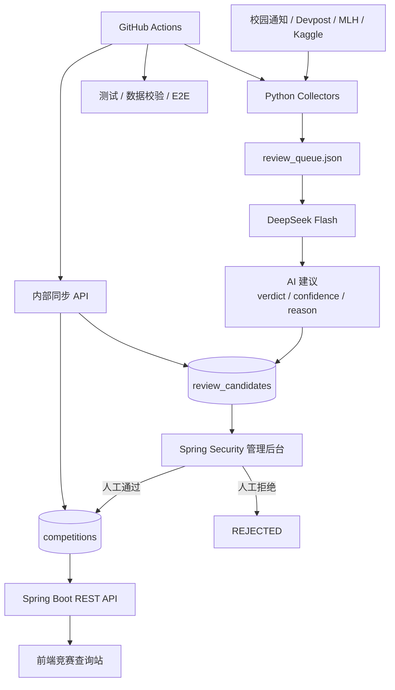

# Competition Search · 南邮竞赛信息平台

<p align="center">
  
</p>

<p align="center">
  面向南京邮电大学学生的竞赛信息聚合、检索与审核平台。<br/>
  从外部数据采集、AI 辅助审核、人工复核，到 Spring Boot API、MariaDB 持久化与前端展示，形成完整的数据闭环。
</p>

<p align="center">
  <a href="https://njupt.cs-contest.cn"></a>
  &nbsp;
  <a href="https://github.com/DoTrungHuy/competition-search/actions/workflows/ci.yml"></a>
  &nbsp;
  <a href="https://github.com/DoTrungHuy/competition-search/actions/workflows/weekly-sync.yml"></a>
</p>

<p align="center">
  
  
  
  
  
</p>

**在线站点：<https://njupt.cs-contest.cn>**

> 本项目不是学校官方报名系统。报名、组队、奖项认定与赛事规则请以赛事官网和学校正式通知为准。

---

## 项目简介

最初这是一个面向南邮学生的竞赛查询静态站，现在已经演进为一个 **后端主导的全栈竞赛数据平台**。

系统会定期从校园通知、Devpost、MLH、Kaggle 等来源采集候选赛事；DeepSeek 只负责给出 **AI 审核建议**，最终是否进入正式竞赛库由管理员人工确认。通过审核的数据写入 MariaDB，再由 Spring Boot REST API 提供给前端展示。

### 首页预览

<p align="center">
  
</p>

---

## 核心架构



整个系统的原则是：

```text
人工审核
   >
AI 建议
   >
自动采集
```

AI 不会直接替代管理员做最终数据决策。

---

## 功能亮点

### 用户侧

- 按名称、品牌、标签搜索竞赛
- 按全国赛 / 大厂赛 / 国际赛等类型筛选
- 展示报名中、即将报名、即将开始、进行中等状态
- 支持学校竞赛认定档位、赛程和参赛要求摘要
- 跳转赛事官网或已核验原始通知
- API 异常时保留静态数据兜底能力

### 管理与数据治理

- Python 自动采集多个数据源
- DeepSeek Flash 对候选赛事给出 `ai_verdict / ai_confidence / ai_reason`
- AI 结果只作为建议，候选仍保持 `PENDING`
- Spring Security 管理员登录
- 单条审核、编辑后通过、拒绝
- 全选 / 批量批准 / 一键批准 HIGH 置信度候选
- 人工审核结果优先，后续自动同步不会覆盖人工决定
- 内容指纹避免同一候选重复调用 AI

### 工程化

- Spring Boot 分层架构：Controller / Service / Repository
- Spring Data JPA + Hibernate ORM
- MariaDB 持久化
- Flyway 数据库版本迁移
- Session + CSRF + 角色权限控制
- GitHub Actions CI
- Python / JavaScript / Java 自动测试
- Playwright E2E 浏览器冒烟测试
- Weekly Sync 自动采集与数据同步
- Cloudflare Tunnel 暴露当前本机后端

---

## 技术栈

| 层 | 技术 |
|---|---|
| 前端 | HTML / CSS / Vanilla JavaScript |
| 后端 | Java 21 / Spring Boot 4.1 / Spring MVC |
| 数据访问 | Spring Data JPA / Hibernate |
| 数据库 | MariaDB |
| 数据库迁移 | Flyway |
| 安全 | Spring Security / Session / CSRF |
| 数据采集 | Python / Requests / Playwright |
| AI 审核 | DeepSeek API |
| 自动化 | GitHub Actions |
| 测试 | JUnit / H2 / Node Test / Python unittest / Playwright |
| 部署 | Linux / Cloudflare Workers / Cloudflare Tunnel |

---

## 后端设计

### 分层结构

```text
Controller
    ↓
Service
    ↓
Repository
    ↓
MariaDB
```

主要业务模块：

```text
backend/src/main/java/cn/trunghuy/competition/
├── controller/
│   ├── CompetitionController.java
│   ├── AdminReviewController.java
│   ├── AdminSessionController.java
│   └── InternalSyncController.java
├── service/
│   ├── CompetitionService.java
│   ├── CompetitionSyncService.java
│   ├── ReviewCandidateSyncService.java
│   └── AdminReviewService.java
├── repository/
│   ├── CompetitionRepository.java
│   └── ReviewCandidateRepository.java
├── entity/
│   ├── Competition.java
│   └── ReviewCandidate.java
└── config/
    └── SecurityConfig.java
```

### 数据模型

当前主要有两类业务数据：

```text
review_candidates
    ↓ 人工审核
competitions
```

`review_candidates` 保存待审核候选、AI 建议、人工审核状态与原始 JSON；`competitions` 是正式对外提供的数据。

审核状态：

```text
PENDING
  ├──→ APPROVED → competitions
  └──→ REJECTED
```

### Flyway

数据库结构不依赖 Hibernate 自动改表，而由 Flyway 管理：

```text
V1__create_competition_tables.sql
V2__create_review_candidates.sql
V3__add_review_decision_fields.sql
```

生产环境使用：

```properties
spring.jpa.hibernate.ddl-auto=validate
```

避免应用启动时静默修改数据库结构。

---

## API

### 公开接口

```http
GET /api/competitions
GET /api/hello
```

### 管理员接口

需要 Spring Security 登录 Session：

```http
GET  /api/admin/reviews
GET  /api/admin/reviews/{id}
POST /api/admin/reviews/{id}/approve
POST /api/admin/reviews/{id}/reject
POST /api/admin/reviews/bulk/approve
```

后台写操作同时启用 CSRF 防护。

### 内部同步接口

供 GitHub Actions / 数据管线调用：

```http
POST /api/internal/sync
POST /api/internal/review-candidates/sync
```

通过独立的 `X-Sync-Token` 认证，不与管理员 Session 混用。

---

## 数据采集与 AI 审核

自动管线：

```text
fetch_*.py
    ↓
draft_*.json
    ↓
review_drafts.py
    ↓
DeepSeek AI 建议
    ↓
review_queue.json
    ↓
内部同步 API
    ↓
review_candidates
    ↓
管理员人工审核
```

当前设计中 DeepSeek **不会自动批准或拒绝**候选，只写入辅助判断：

```text
ai_verdict
ai_confidence
ai_reason
```

候选内容未发生变化时，会复用已有 AI 结果，避免重复消耗 API。

---

## Weekly Sync

GitHub Actions 每周自动执行：

```text
采集多个数据源
      ↓
汇总采集健康状态
      ↓
DeepSeek 生成审核建议
      ↓
刷新固定清单预计报名
      ↓
数据校验
      ↓
JS / Python 测试
      ↓
提交数据变化
      ↓
同步 MariaDB
      ↓
外链健康巡检
```

特点：

- 双 cron 时间槽，降低 GitHub Actions 定时漏跑影响
- 本周已成功执行时备用槽自动跳过
- 单个采集源失败可容忍
- 所有实际数据源都失败时整轮失败
- AI 可通过变量独立开关
- 数据校验或测试失败时不会提交生产数据

---

## 项目目录

```text
competition-search/
├── backend/                    # Spring Boot 后端
│   ├── src/main/java/          # Controller / Service / Repository / Entity
│   └── src/main/resources/
│       ├── db/migration/       # Flyway SQL
│       └── static/admin/       # 管理员审核后台
├── data/
│   ├── competitions.json       # 静态生产数据 / 版本记录
│   ├── review_queue.json       # AI 辅助审核队列
│   ├── brands.json
│   └── sync_state.json
├── scripts/                    # Python 数据采集与校验
├── js/                         # 前端交互逻辑
├── css/                        # 前端样式
├── tests/
│   ├── js/
│   ├── python/
│   └── e2e/
├── .github/workflows/
│   ├── ci.yml
│   └── weekly-sync.yml
├── index.html
└── about.html
```

---

## 本地开发

### 1. 前端

```bash
npm run serve
```

浏览器打开 `http://localhost:4173`。

### 2. Python 数据脚本

```bash
python -m pip install -r requirements-scripts.txt
```

常用命令：

```bash
python scripts/validate_data.py
python scripts/check_links.py
```

### 3. Spring Boot

需要：

- Java 21
- MariaDB

复制环境变量模板：

```bash
cp backend/.env.example backend/.env.local
```

主要环境变量：

```text
DB_URL
DB_USERNAME
DB_PASSWORD
SYNC_TOKEN
ADMIN_USERNAME
ADMIN_PASSWORD
SESSION_COOKIE_SECURE
```

构建并启动：

```bash
cd backend
./mvnw -DskipTests package
./scripts/start-backend.sh
```

`start-backend.sh` 会读取 `backend/.env.local`，并在需要时尝试启动本机 MariaDB。默认监听 `127.0.0.1:8080`。

停止后端：

```bash
./scripts/stop-backend.sh
```

> `.env.local`、API Key、数据库密码和 Token 不应提交到 Git。

---

## 测试

### 前端 / Python / 数据校验

```bash
npm test
```

包括：

- JavaScript 语法检查
- JavaScript 单元测试
- Python 单元测试
- 生产数据校验

### Spring Boot

```bash
cd backend
./mvnw test
```

覆盖：

- Flyway migration
- Repository / Service
- Competition sync
- Review candidate sync
- 人工审核流程
- 批量审核
- Spring Security
- Session / CSRF
- 内部同步接口

### E2E

```bash
python -m pip install -r requirements-playwright.txt
python -m playwright install chromium
npm run test:e2e
```

CI 中 E2E 与普通测试并行运行。

---

## 安全设计

- 数据库只由 Spring Boot 访问，不直接暴露给公网
- 管理后台使用 Spring Security Session
- 后台写操作启用 CSRF
- Session Cookie 设置 `Secure / HttpOnly / SameSite=Lax`
- GitHub Actions 使用独立同步 Token
- API Key、数据库密码、管理员密码放在环境变量 / GitHub Secrets
- DeepSeek 只提供建议，不拥有最终生产数据决策权

---

## 部署

当前部署形态：

```text
前端
njupt.cs-contest.cn
    ↓
Cloudflare Workers 静态资源

后端
api.cs-contest.cn
    ↓
Cloudflare Tunnel
    ↓
127.0.0.1:8080
    ↓
Spring Boot
    ↓
MariaDB
```

当前机器位于 NAT 网络后，因此使用 Cloudflare Tunnel 将本地 Spring Boot 暴露到公网。

---

## Roadmap

当前重点不是继续堆业务功能，而是补生产部署能力：

- [ ] Docker + Docker Compose
- [ ] 正式公网服务器部署
- [ ] Nginx 反向代理与 HTTPS
- [ ] Spring Boot Actuator 健康检查
- [ ] 后端 / Tunnel 自动启动与故障恢复
- [ ] MariaDB 自动备份
- [ ] API 分页与查询优化

Redis、MQ、微服务、Kubernetes 暂不引入：当前业务规模没有真实需求。

---

## 项目价值

这个项目重点不在“用了多少框架”，而在于完成了一条真实的数据闭环：

```text
数据采集
  ↓
AI 辅助判断
  ↓
人工数据治理
  ↓
关系型数据库
  ↓
REST API
  ↓
前端展示
  ↓
CI / 自动同步 / 线上部署
```

对于后端实践，项目覆盖了 Java Web 开发、数据库设计、权限控制、事务、数据迁移、自动测试、CI/CD 和线上部署等完整环节。

---

## 声明

数据与链接可能存在滞后或遗漏。

**报名、组队、赛程、奖项及学校认定请始终以赛事官网与学校正式通知为准。**

本项目为个人学习与信息查询辅助工具，不代表南京邮电大学官方教务部门、竞赛组织方或任何赛事主办方。
